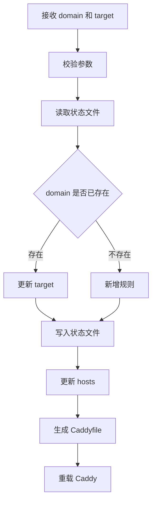
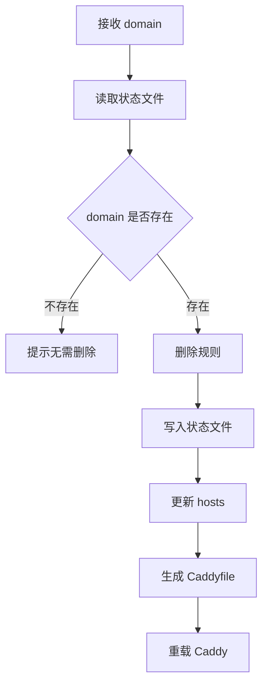

# fast-proxy 最小可用设计文档

## 1. 背景

本工具用于快速配置本地开发环境中的反向代理。

典型场景：开发者希望通过 `domainA` 访问本机服务 `localhost:3000`。工具需要自动完成两件事：

- 修改本机 `hosts`，将域名指向 `127.0.0.1`
- 维护 Caddy 配置，将该域名反向代理到目标本地端口

工具以命令行脚本形式提供，使用 Go 编写。

## 2. 目标

最小可用版本只解决一个核心问题：添加和删除本地域名反向代理。

必须支持：

- 添加代理规则：`domain -> localhost:port`
- 删除代理规则
- 自动维护 `hosts` 中由本工具创建的记录
- 自动维护 Caddy 配置中由本工具创建的反向代理配置
- 操作前做基础校验，避免明显错误配置

暂不支持：

- 图形界面
- 多用户配置
- 远程服务器代理
- HTTPS 证书自定义管理
- 复杂路径路由、负载均衡、鉴权等高级 Caddy 能力
- 自动安装 Caddy

## 3. 使用方式

命令名暂定为 `fast-proxy`。

### 添加代理

```bash
fast-proxy add domainA localhost:3000
```

执行后效果：

- `hosts` 增加 `127.0.0.1 domainA`
- Caddy 配置增加 `domainA` 的反向代理规则
- 重载 Caddy

### 删除代理

```bash
fast-proxy remove domainA
```

执行后效果：

- 从 `hosts` 删除本工具管理的 `domainA` 记录
- 从 Caddy 配置删除 `domainA` 的反向代理规则
- 重载 Caddy

### 查看代理

```bash
fast-proxy list
```

执行后展示当前由本工具管理的代理规则。

`list` 不是核心写操作，但对最小可用版本很重要，便于用户确认当前状态。

## 4. 配置文件约定

为了降低实现复杂度，最小可用版本使用固定文件路径。

### 工具状态文件

```text
~/.fast-proxy/config.json
```

用于记录工具管理的代理规则。

示例：

```json
{
  "rules": [
    {
      "domain": "domainA",
      "target": "localhost:3000"
    }
  ]
}
```

该文件是 `list`、删除和幂等更新的依据。

### hosts 文件

Linux/macOS：

```text
/etc/hosts
```

MVP 优先支持 Linux/macOS。Windows 可后续扩展。

为了避免误删用户已有配置，工具只修改带有标记的行。

示例：

```text
127.0.0.1 domainA # fast-proxy
```

### Caddy 配置文件

默认配置文件：

```text
~/.fast-proxy/Caddyfile
```

工具只维护自己的 Caddyfile，不直接改用户系统级 Caddyfile。

主 Caddyfile 只负责引入站点片段：

```caddyfile
import ~/.fast-proxy/sites/*.caddy
```

每个代理规则单独生成一个站点配置文件：

```text
~/.fast-proxy/sites/domainA.caddy
```

示例：

```caddyfile
domainA {
    reverse_proxy localhost:3000
}
```

用户需要让 Caddy 使用该文件启动：

```bash
caddy run --config ~/.fast-proxy/Caddyfile
```

MVP 阶段不负责常驻进程管理，只在配置变更后尝试执行 Caddy 重载。

## 5. 核心流程

### 添加流程



### 删除流程



## 6. 参数校验

### domain

最小校验规则：

- 非空
- 不包含空格
- 不包含 `/`、`:`
- 不允许为 `localhost`

### target

最小校验规则：

- 格式为 `host:port`
- `port` 为 `1-65535` 的整数
- MVP 推荐目标主机为 `localhost` 或 `127.0.0.1`

## 7. 权限处理

修改 `/etc/hosts` 通常需要管理员权限。

MVP 采用简单策略：

- 如果当前用户无法写入 `/etc/hosts`，直接提示使用 `sudo`
- 不在程序内部尝试提权
- 不保存密码或执行交互式提权逻辑

示例：

```bash
sudo fast-proxy add domainA localhost:3000
```

## 8. Caddy 重载策略

配置变更后执行：

```bash
caddy reload --config ~/.fast-proxy/Caddyfile
```

如果重载失败：

- 输出错误信息
- 提示用户确认 Caddy 是否已安装、是否正在运行
- 保留已生成的配置文件，方便用户手动排查

MVP 不自动启动 Caddy。后续版本可增加 `fast-proxy start`。

## 9. 数据一致性

MVP 需要保证同一条规则不会重复写入。

实现策略：

- 状态文件以 `domain` 作为唯一键
- 每次修改后重新生成主 Caddyfile 和 `sites/*.caddy` 站点片段
- 每次修改 hosts 时，先删除旧的 `# fast-proxy` 管理行，再按当前状态重新写入

这种方式实现简单，也能避免局部修改 Caddyfile 带来的解析复杂度。

## 10. Go 模块设计

推荐目录结构：

```text
fast-proxy/
  cmd/fast-proxy/main.go
  internal/app/app.go
  internal/config/store.go
  internal/hosts/hosts.go
  internal/caddy/caddy.go
  doc/需求.md
  doc/设计.md
  go.mod
```

模块职责：

- `cmd/fast-proxy/main.go`：命令行入口，解析参数
- `internal/app`：编排 add/remove/list 流程
- `internal/config`：读写 `~/.fast-proxy/config.json`
- `internal/hosts`：读写 `/etc/hosts`
- `internal/caddy`：生成 Caddyfile 并执行 reload

## 11. 错误处理

常见错误与提示：

| 场景 | 处理 |
| --- | --- |
| domain 格式错误 | 提示合法格式 |
| target 格式错误 | 提示使用 `localhost:3000` 形式 |
| 无权限修改 hosts | 提示使用 `sudo` |
| Caddy 未安装 | 提示安装 Caddy |
| Caddy reload 失败 | 输出 reload 错误 |
| 删除不存在的 domain | 提示规则不存在，不报致命错误 |

## 12. 最小可用验收标准

完成 MVP 后，以下命令应可工作：

```bash
sudo fast-proxy add domainA localhost:3000
fast-proxy list
sudo fast-proxy remove domainA
```

验收点：

- 添加后 `/etc/hosts` 存在 `127.0.0.1 domainA # fast-proxy`
- 添加后 `~/.fast-proxy/Caddyfile` 存在 `domainA` 的 `reverse_proxy localhost:3000`
- 重复添加同一 domain 不产生重复配置
- 删除后 hosts 和 Caddyfile 中不再存在该 domain
- `list` 能展示当前状态文件中的规则

## 13. 后续扩展

MVP 稳定后可以考虑：

- 支持自定义 Caddyfile 路径
- 支持 `fast-proxy start` 和 `fast-proxy stop`
- 支持 Windows hosts 路径
- 支持 HTTPS、本地证书和 `tls internal`
- 支持路径代理，例如 `domainA/api -> localhost:3000`
- 支持检测目标端口是否可访问